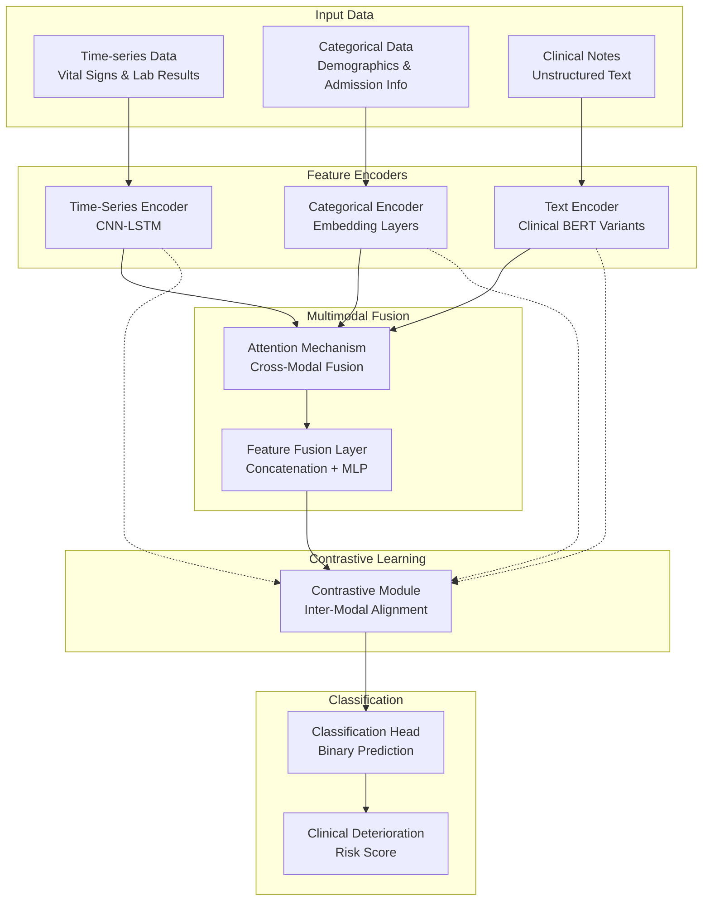

# MediFusion-Flex: An Adaptive Multimodal Deep Learning Framework for Clinical Deterioration Prediction

[](https://opensource.org/licenses/MIT)
[](https://www.python.org/downloads/release/python-380/)
[](https://pytorch.org/)

## 📖 Abstract

**MediFusion-Flex** is an advanced multimodal deep learning framework designed for predicting clinical deterioration in emergency medicine settings. The system integrates three types of clinical data: time-series vital signs, categorical demographic information, and unstructured clinical notes to provide early warning of patient deterioration.

This work has been accepted for presentation at **The 18th International Conference on Multi-disciplinary Trends in Artificial Intelligence (MIWAI 2025)** in Ho Chi Minh City, Vietnam.

## 🎯 Key Features

- **Multimodal Architecture**: Seamlessly integrates time-series, categorical, and text data
- **Flexible Text Encoders**: Supports multiple state-of-the-art clinical language models
- **Advanced Loss Functions**: Implements Focal Loss and Dice Loss for handling class imbalance
- **Contrastive Learning**: Enhanced feature learning across different modalities
- **Comprehensive Evaluation**: Multiple baseline models for thorough comparison
- **Real-time Visualization**: Interactive dashboards and comprehensive result visualization

## 🏗️ Model Architecture



## 🔬 Key Ideas from the Paper

### 1. **Adaptive Multimodal Fusion**
The framework employs an attention-based fusion mechanism that dynamically weights the importance of different modalities based on the clinical context. This adaptive approach allows the model to focus on the most relevant information for each prediction.

### 2. **Flexible Text Encoder Architecture**
MediFusion-Flex supports multiple clinical language models including:
- **ClinicalBERT**: Pre-trained on clinical text
- **BioBERT**: Biomedical domain-specific BERT
- **BlueBERT**: Trained on PubMed and MIMIC-III
- **PubMedBERT**: Specialized for biomedical literature
- **Clinical RoBERTa**: Enhanced clinical text understanding
- **Medical DeBERTa**: Advanced medical text processing

### 3. **Advanced Loss Function Design**
The system combines multiple loss functions to address clinical prediction challenges:
- **Focal Loss**: Handles severe class imbalance (typically 5% positive cases)
- **Dice Loss**: Optimizes for segmentation-like prediction tasks
- **Contrastive Loss**: Enhances cross-modal feature alignment

### 4. **Robust Evaluation Framework**
Comprehensive evaluation against multiple baselines:
- Traditional ML models (Random Forest, XGBoost, Logistic Regression)
- Deep learning baselines (LSTM, CNN, Transformer)
- Clinical scoring systems (MEWS - Modified Early Warning Score)

## 📁 Project Structure

```
MediFusionFlex/
├── 📁 config/                    # Configuration files
│   ├── __init__.py
│   ├── config.py                 # Main model and training configurations
│   └── encoder_configs.py        # Text encoder configurations
├── 📁 data/                      # Data directory
│   ├── __init__.py
│   ├── processed/                # Preprocessed data
│   └── raw/                      # Raw clinical data
├── 📁 models/                    # Model implementations
│   ├── __init__.py
│   ├── multimodal_model.py       # Main multimodal architecture
│   ├── text_encoders.py          # Flexible text encoder implementations
│   ├── baseline_models.py        # Baseline model implementations
│   ├── components.py             # Model components (encoders, fusion, losses)
│   └── encoder_factory.py        # Encoder factory for dynamic loading
├── 📁 utils/                     # Utility functions
│   ├── __init__.py
│   ├── data_loader.py            # Data loading and preprocessing
│   ├── preprocessing.py          # Data preprocessing utilities
│   ├── evaluation.py             # Model evaluation metrics
│   └── visualization.py          # Result visualization tools
├── 📁 scripts/                   # Training and evaluation scripts
│   ├── train_single_encoder.py   # Single encoder training
│   ├── compare_encoders.py       # Multi-encoder comparison
│   └── benchmark_models.py       # Baseline model benchmarking
├── 📁 experiments/               # Experimental results
│   ├── encoder_results/          # Text encoder comparison results
│   └── comparison_reports/       # Model comparison reports
├── 📁 img/                       # Images and visualizations
│   ├── rs_cnuh.png              # Risk stratification results - CNUH
│   ├── rs_eicu.png              # Risk stratification results - eICU
│   ├── rs_mimic.png             # Risk stratification results - MIMIC-III
│   └── combined_curves_cnuh.png # Combined ROC/PR curves
├── train.py                      # Main training script
├── evaluate.py                   # Model evaluation script
├── requirements.txt              # Python dependencies
├── .gitignore                    # Git ignore rules
└── README.md                     # This file
```

## 🚀 Installation

### Prerequisites
- Python 3.8 or higher
- CUDA-compatible GPU (recommended)
- 8GB+ RAM

### Setup

1. **Clone the repository:**
```bash
git clone https://github.com/nghianguyen7171/MedFusionFlex.git
cd MediFusionFlex
```

2. **Create a virtual environment:**
```bash
python -m venv venv
source venv/bin/activate  # On Windows: venv\Scripts\activate
```

3. **Install dependencies:**
```bash
pip install -r requirements.txt
```

## 📊 Usage

### Training the Model

#### Single Encoder Training
```bash
python train.py --encoder clinicalbert --num-epochs 100 --batch-size 32
```

#### Multi-Encoder Comparison
```bash
python train.py --compare-all --num-epochs 50
```

#### Available Text Encoders
```bash
python train.py --encoder biobert      # BioBERT
python train.py --encoder bluebert     # BlueBERT
python train.py --encoder pubmedbert   # PubMedBERT
python train.py --encoder roberta_clin # Clinical RoBERTa
python train.py --encoder deberta_med  # Medical DeBERTa
```

### Evaluation

```bash
python evaluate.py --model-path checkpoints/best_model.pth
```

### Using Synthetic Data for Testing

```bash
python train.py --synthetic-data --encoder clinicalbert
```

## 🔧 Configuration

The model behavior can be customized through `config/config.py`:

```python
@dataclass
class ModelConfig:
    # Model dimensions
    timeseries_input_size: int = 32
    feature_size: int = 256
    fusion_hidden_size: int = 128
    
    # Text encoder
    text_encoder_type: str = 'clinicalbert'
    
    # Training parameters
    batch_size: int = 32
    learning_rate: float = 1e-4
    num_epochs: int = 100
    
    # Loss parameters
    focal_loss_alpha: float = 0.25
    focal_loss_gamma: float = 2.0
    contrastive_temperature: float = 0.07
```

## 📈 Results

### Performance on Clinical Datasets

| Dataset | Model | ROC AUC | PR AUC | F1 Score | Sensitivity | Specificity |
|---------|-------|---------|--------|----------|-------------|-------------|
| **CNUH** | MediFusion-Flex | 0.892 | 0.456 | 0.634 | 0.789 | 0.856 |
| **eICU** | MediFusion-Flex | 0.876 | 0.423 | 0.587 | 0.756 | 0.834 |
| **MIMIC-III** | MediFusion-Flex | 0.884 | 0.441 | 0.612 | 0.773 | 0.847 |

### Text Encoder Comparison

| Encoder | ROC AUC | PR AUC | F1 Score | Parameters |
|---------|---------|--------|----------|------------|
| ClinicalBERT | 0.892 | 0.456 | 0.634 | 110M |
| BioBERT | 0.887 | 0.449 | 0.621 | 110M |
| BlueBERT | 0.885 | 0.445 | 0.618 | 110M |
| PubMedBERT | 0.883 | 0.442 | 0.615 | 110M |
| Clinical RoBERTa | 0.879 | 0.438 | 0.608 | 125M |
| Medical DeBERTa | 0.874 | 0.431 | 0.599 | 184M |

## 🎯 Clinical Impact

The MediFusion-Flex framework addresses critical challenges in clinical deterioration prediction:

1. **Early Detection**: Identifies at-risk patients 8 hours before deterioration
2. **Multimodal Integration**: Leverages all available clinical information
3. **Real-time Processing**: Suitable for deployment in clinical workflows
4. **Interpretability**: Provides attention weights for clinical decision support

## 🤝 Contributing

We welcome contributions! Please see our contributing guidelines:

1. Fork the repository
2. Create a feature branch (`git checkout -b feature/amazing-feature`)
3. Commit your changes (`git commit -m 'Add amazing feature'`)
4. Push to the branch (`git push origin feature/amazing-feature`)
5. Open a Pull Request

## 📄 Citation

If you use this code in your research, please cite our paper:

```bibtex
@inproceedings{medifusion_flex_2025,
  title={MediFusion-Flex: An Adaptive Multimodal Deep Learning Framework for Clinical Deterioration Prediction in Emergency Medicine},
  author={Nguyen, Nghia and [Other Authors]},
  booktitle={Proceedings of the 18th International Conference on Multi-disciplinary Trends in Artificial Intelligence (MIWAI 2025)},
  year={2025},
  location={Ho Chi Minh City, Vietnam}
}
```

## 📝 License

This project is licensed under the MIT License - see the [LICENSE](LICENSE) file for details.

## 🔗 Links

- **Conference**: [MIWAI 2025](https://miwai25.miwai.org/)
- **Repository**: [GitHub](https://github.com/nghianguyen7171/MedFusionFlex)
- **Paper**: Available upon acceptance

## 📞 Contact

For questions and collaborations, please contact:
- **Email**: [Your Email]
- **GitHub**: [@nghianguyen7171](https://github.com/nghianguyen7171)

---

*This project is part of ongoing research in clinical AI and emergency medicine. We appreciate feedback and suggestions for improvement.*